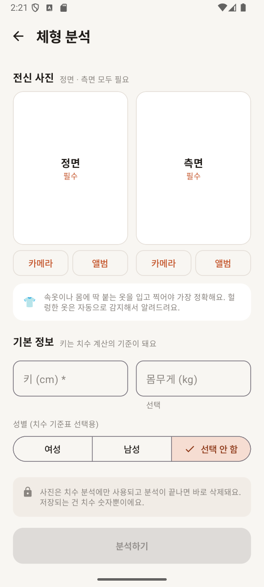
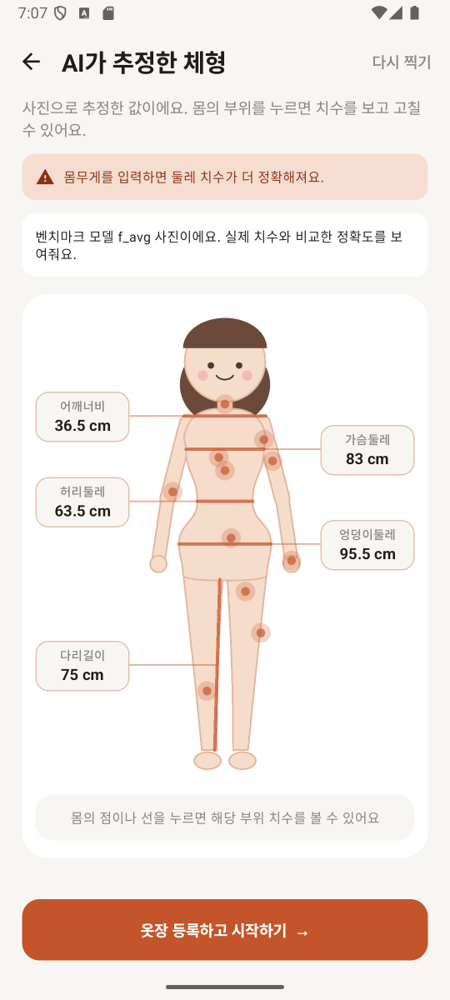
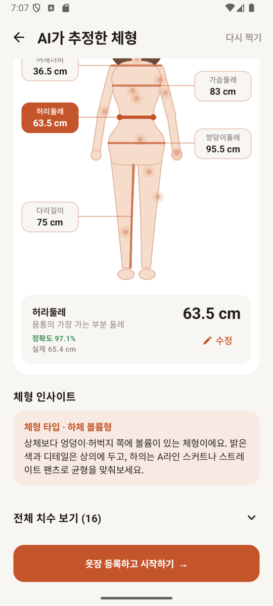
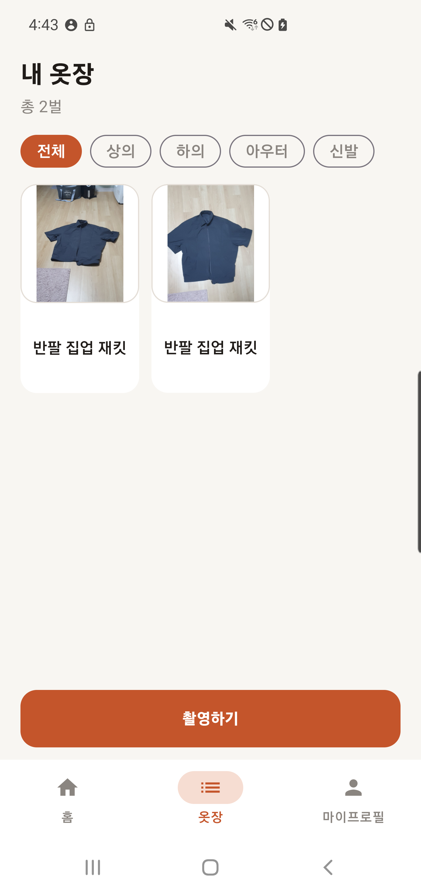
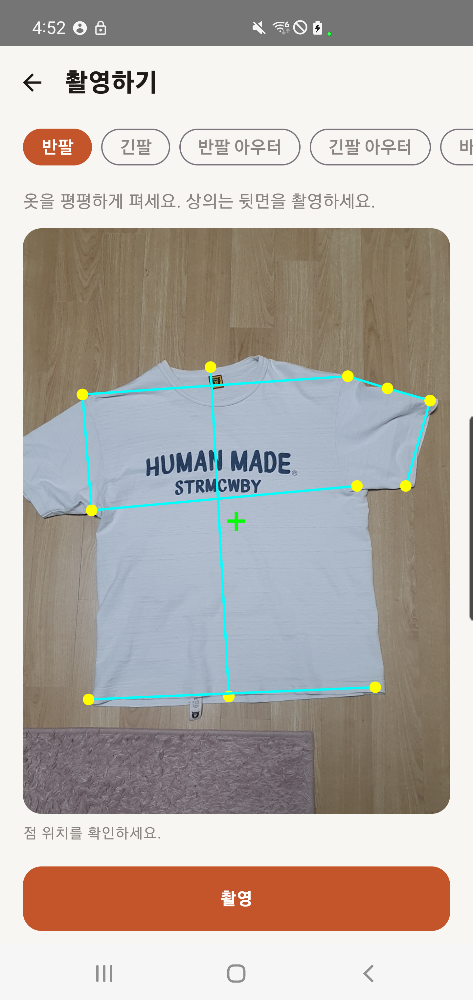
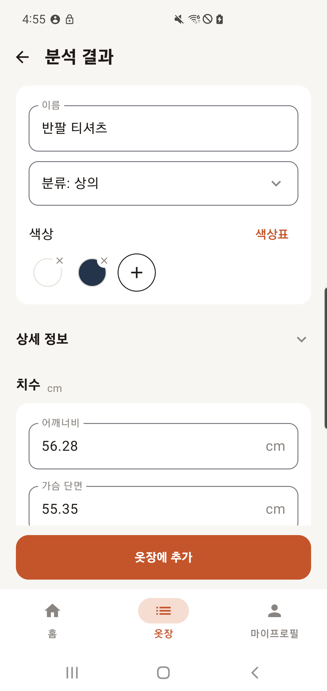

# StyleMate – AI Fashion Partner · Iteration 1 Demo

SWPP 2026 Fall · Team 14 "0103" (Hyeon U Jeong, Dongkun Moon, Kihwan Kim, Juhyeon Choi)

StyleMate is an Android app that learns the user's body and wardrobe and suggests outfits from the clothes they already own.
Iteration 1 prototypes **body measurements from two phone photos** and **adding measured, AI-labelled clothes to a personal wardrobe**, plus the backend and deployment pipeline everything else will run on.

**Body analysis**

| Photo input | Results (AI가 추정한 체형) | Real accuracy on a benchmark body |
|---|---|---|
|  |  |  |

**Wardrobe**

| Wardrobe input | Automatic measurement points | Analysis results |
|---|---|---|
|  |  |  |

## Demo video

▶ **[TODO: link to the demo video]**

---

## What this demo demonstrates

### Features implemented

**Body analysis (P9 screen, P10 AI integration)**
- **Onboarding flow:** capture guide → front + side photo (camera or album) → height (required), weight and gender (optional) → analysis → results → My Profile.
- **16 garment measurements** (ISO 8559-1 names) from the two photos on a CPU-only server:
  - lengths: shoulder width, sleeve, torso, rise, inseam, outseam
  - circumferences: neck, chest, underbust, waist, hip, armhole, bicep, wrist, thigh, calf
- **Results screen:** a cartoon body figure (female / male / neutral) with shoulder, chest, waist, hip and inseam always visible. Tapping any other body part shows that measurement, which the user can correct.
- **Body-shape insights** in neutral styling language (body type, leg proportion, shoulders). An insight is shown only when it is clearly past its threshold.
- **Loose clothing is detected automatically.** Users are not asked what they wore. The app warns, lowers confidence only for the affected measurements, and hides insights that depend on them.
- **Retake hints** for unusable photos: no person, several people, body cut off, wrong view, upside down, unreadable file.
- **Privacy:** photos are processed in memory and dropped right after analysis. Only numbers are kept.
- **Real accuracy for benchmark photos:** for our 8 synthetic benchmark bodies, whose true measurements are known, the app shows "정확도 98.7%" and the true value per measurement.

**Wardrobe capture, measurement and AI analysis**
- **Clothing addition flow:** wardrobe → camera → measurement points → photo and cm values → AI analysis → edit → add to wardrobe.
- **Automatic measurement points:** GarmentIQ HRNet proposes points for tops, outerwear, trousers, shorts and skirts. Users choose the garment type, check the suggested points and can replace them by tapping the photo.
- **Measurements without a reference object:** ARCore tracks the floor plane; camera rays through the selected points are intersected with that plane to calculate lengths in cm. No ruler, reference card or fixed camera height is needed. Clothes must lie flat, and the phone must first recognise the floor.
- **AI labels:** Gemini `gemini-3.1-flash-lite` suggests the name, category and one or two representative colours. It does not estimate cm values or fabric properties.
- **Editable results:** change the name, category, colours, optional details and measurements, and add a note. Colours use a palette; tapping `+` lets the user pick a colour directly from the photo (up to five colours in total). Measurements are shown to two decimal places.
- **Saved wardrobe:** browse by category, reopen a garment and edit it. MySQL stores the attributes, measurements and notes; the server stores the garment photo. Retrying a save reuses the same record instead of adding a duplicate.

**Backend and infrastructure**
- Django APIs for body analysis (`POST /api/body-profile/analyze/`) and wardrobe measurement, analysis and storage (`/api/wardrobe/`), a Docker image, and a GHCR + Argo CD GitOps pipeline on k3s (Azure VM).
- **Model setup is part of the Docker build:** pinned HRNet source and weights are downloaded, checksum-verified and exported to ONNX. The final image contains the model and licence; PyTorch is only used during the build. No manual model upload is needed.
- CI on relevant PRs: backend tests, Docker image checks for both models (including actual HRNet inference) and a server health check, plus Android unit tests and an APK build.

### Goals and what we validated

| Question | Result |
|---|---|
| Can phone photos give usable body measurements? | On 8 synthetic benchmark bodies: **mean accuracy 98.7 %** in underwear and 98.8 % in tight clothing, about 0.5 cm mean error ([report](docs/body-analysis/07-accuracy-report.md)). Real-photo validation with tape measurements is the next step. |
| Does body analysis run on our server budget? | Yes: CPU only, about 0.5 s per analysis on a laptop CPU once the model is loaded, about 340 MiB memory in the container (1 Gi limit on the VM). This does not include HRNet; combined memory use still needs measuring. |
| Is it robust to bad input? | Stress-tested with 11 image formats, sizes from 30×40 to 6000×8000, broken files and wrong photos, all with no server errors. Concurrent requests are safe. |
| Can users check the body estimates? | Every value is editable and labelled with confidence. Loose clothing triggers a warning instead of silently wrong numbers. |
| Can clothes be measured without a reference card? | Implemented with HRNet image points and ARCore floor-plane geometry. Points and cm values can be corrected; accuracy against tape measurements is not yet validated. |
| Can analysed clothes be saved and reopened? | Implemented with MySQL records and server-side photos. Tests cover analysis drafts, editing, migrations, save retries and retrieval. |
| Will a fresh Docker image include the wardrobe model? | Yes: CI builds the image, runs HRNet inference inside it and verifies the output shape and finite values. |

Known limitations in this demo:
- The 홈 tab and outfit recommendations are still placeholders; the 옷장 tab supports capture, analysis and storage.
- The accuracy numbers come from synthetic bodies and are optimistic.
- The results-screen design is still under discussion.
- Garment measurements assume the clothes and floor are on the same plane. Automatic points can be wrong; users should check them. Two decimal places are display precision, not a claim of measurement accuracy.
- Wardrobe capture requires an ARCore-supported phone. The emulator body-photo demo does not validate AR measurement.
- Login, per-user wardrobe separation, S3, garment deletion and abandoned-draft cleanup are not implemented. Unlike body photos, wardrobe photos are retained on the server. Use this as a local/team demo, not a public multi-user service.

---

## How to run the demo

### Environment we used

| | Version |
|---|---|
| OS | Windows 11 |
| Android Studio | 2025.3.3 (bundled JDK 21) |
| Android emulator | "Medium Phone", Android 16 (API 36), x86_64, 4 GB RAM, Graphics: Software |
| App | Kotlin 2.2, Jetpack Compose, minSdk 26, targetSdk 36 |
| Backend (local) | Python 3.11.9, Django 5.2, MediaPipe 1.0.1 |
| Backend (deployed) | Docker `python:3.12-slim`, gunicorn |
| Wardrobe capture device | Samsung SM-G977N, Android 12 (API 31), Google Play Services for AR |
| Wardrobe backend | Python 3.12.14, MySQL, ONNX Runtime 1.23.2, Gemini `gemini-3.1-flash-lite` |

### 1. Start the backend

```bash
cd backend
py -3.11 -m venv .venv
.venv\Scripts\python -m pip install -r requirements-dev.txt
mkdir models
curl -L -o models/pose_landmarker_heavy.task https://storage.googleapis.com/mediapipe-models/pose_landmarker/pose_landmarker_heavy/float16/latest/pose_landmarker_heavy.task
set DJANGO_DEBUG=1
.venv\Scripts\python manage.py runserver 0.0.0.0:8000
```

Check: `curl http://127.0.0.1:8000/healthz/` returns `{"status": "ok"}`.

The first analysis takes a few seconds longer while the pose model loads.
To run the Docker image instead, see [backend/README.md](backend/README.md#docker-image-what-runs-in-the-cluster). For the emulator, add `-e DJANGO_ALLOWED_HOSTS=localhost,127.0.0.1,10.0.2.2`.

**For the wardrobe demo**, also complete the [wardrobe setup](docs/wardrobe/local-development.md):

1. Copy `backend/.env.example` to `backend/.env` if it does not already exist. Fill in an existing MySQL database/account and `GEMINI_API_KEY`; keep this file out of Git.
2. Start MySQL, then run `.venv\Scripts\python manage.py migrate` from `backend/`.
3. For a local Python server, prepare HRNet with the [model setup instructions](docs/wardrobe/local-development.md#4-모델-준비). Docker builds do this automatically.
4. Restart Django after changing environment variables. Body analysis and garment landmark detection can run without MySQL; wardrobe analysis, listing and saving require it.

In the cluster, MySQL settings, the Gemini key and a writable persistent photo directory must be supplied separately. Do not mount an empty volume over the bundled model directory. Merging this demo branch alone does not deploy it: automatic releases track `main`.

### 2. Run the app

1. Open the `frontend/` folder in Android Studio and let Gradle sync.
2. Start an emulator and press **Run**. The app reaches the local server at `http://10.0.2.2:8000` by default.
   - On a real phone on the same Wi-Fi, add `stylemate.apiBaseUrl=http://<PC IP>:8000` to `frontend/local.properties`.
   - For a USB phone, use `stylemate.apiBaseUrl=http://127.0.0.1:8000` and run `adb reverse tcp:8000 tcp:8000` with the Android SDK's `platform-tools/adb`. Repeat the reverse command after reconnecting USB.
   - If the emulator shows a black screen, set Graphics to **Software** and RAM to 4 GB in the Device Manager.

Rebuild the app after changing `stylemate.apiBaseUrl`. Use an ARCore-supported physical phone for wardrobe measurement and allow camera access when prompted.

### 3. Try the body analysis with the demo photos

`demo/photos/` has front and side photos of the 8 benchmark bodies. These are synthetic 3D renders, not real people.

1. Copy the photos into the emulator's gallery (PowerShell, from the repository root):
   ```powershell
   & "$env:LOCALAPPDATA\Android\Sdk\platform-tools\adb.exe" push demo\photos\. /sdcard/Download/
   & "$env:LOCALAPPDATA\Android\Sdk\platform-tools\adb.exe" shell content call --uri content://media --method scan_volume --arg external_primary
   ```
   Dragging files onto the emulator does not make them appear in the photo picker; the scan command does.
2. In the app, tap **사진 찍으러 가기** and pick `<body>_front.png` as 정면 and `<body>_side.png` as 측면 (앨범).
3. Enter the body's **true height** and gender from the table below, then tap **분석하기**.
4. On the results screen, tap a body part. Each value shows "정확도 …%" and the true measurement. Open **전체 치수 보기** to see all 16.

| Body | Gender | Height (cm) | | Body | Gender | Height (cm) |
|---|---|---|---|---|---|---|
| `f_avg` | 여성 | 160.0 | | `m_avg` | 남성 | 168.2 |
| `f_slim_tall` | 여성 | 186.8 | | `m_slim` | 남성 | 179.2 |
| `f_heavy` | 여성 | 154.8 | | `m_heavy` | 남성 | 168.2 |
| `f_short` | 여성 | 133.0 | | `m_muscular_tall` | 남성 | 196.3 |

A different height lowers the accuracy, because every value scales with it; the app says so. Your own full-body photos also work (A-pose, plain background, tight clothing). For those the app shows confidence badges instead of an accuracy %.

### 4. Try adding a garment

1. Open **옷장** after onboarding. **건너뛰기** on the body capture guide also opens the wardrobe without analysing a body first.
2. Tap **촬영하기**, allow camera access and choose the garment type (for example, **반팔** or **바지**).
3. Lay the garment flat. Photograph tops from the back. Move the phone slowly over the surrounding floor until AR tracking is ready, then keep the whole garment in view and tap **촬영**.
4. On **치수 확인**, inspect the proposed points and cm values. Select a measurement and tap its start and end points to correct it if needed, then tap **확인**.
5. Tap **분석하기**. Gemini fills in the name, category and representative colours. Check the results, adjust measurements or colours, and optionally add a note.
6. Tap **옷장에 추가**. The garment appears in the wardrobe; tap its card to view or edit it again.

The wardrobe screenshots are captured from the running Android app on a physical phone. The measurement and result screens show the same T-shirt: live HRNet point suggestions, followed by Gemini labels and editable ARCore measurements. The results screen is scrolled to show the name, category, colours and measurements. These demonstrate the workflow, not an accuracy benchmark.

### Tests

From the repository root (PowerShell):

```powershell
cd backend
.\.venv\Scripts\python.exe -m pytest
.\.venv\Scripts\python.exe manage.py test apps.wardrobe --settings=config.test_settings --noinput
cd ../frontend
.\gradlew.bat testDebugUnitTest
```

The wardrobe tests use an isolated in-memory test database and mock paid AI calls. Backend CI additionally builds the Docker image and runs both models inside it.

---

## Repository layout

| Path | Contents |
|---|---|
| `frontend/` | Android app (Kotlin, Jetpack Compose) |
| `backend/` | Django API, `body_analysis/` (body measurements), `apps/wardrobe/` (landmarks, Gemini and garment storage), and model preparation scripts |
| `infra/` | Kubernetes manifests deployed by Argo CD |
| `docs/body-analysis/` | Model research, design, benchmark plan and results, accuracy report |
| `docs/wardrobe/` | Wardrobe design, schema, capture flow, architecture and local setup |
| `demo/` | Demo photos and screenshots (this branch only) |

Design and requirements documents are on the [GitHub Wiki](https://github.com/snuhcs-course/swpp-2026-project-team-14/wiki).
