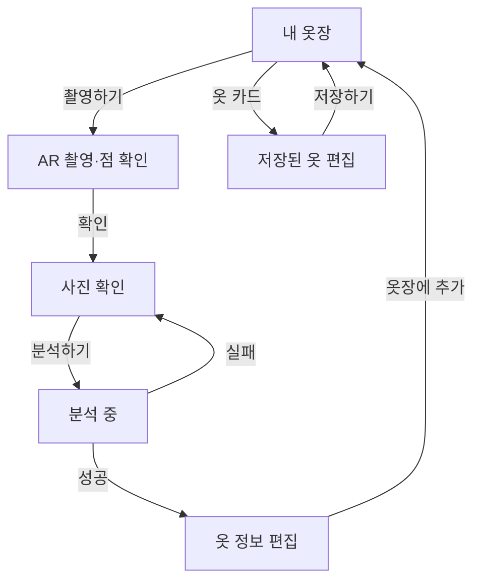

# StyleMate · Wardrobe 화면 설계

수정일: 2026-10-05 · 기준: 현재 Android 옷장 구현

## 1. 범위

공통 앱의 옷장 탭에서 목록·카테고리 필터·AR 촬영·분석·편집·저장을 제공한다. 저장된 옷 카드는 별도 상세 화면 없이 편집 화면으로 연결한다. 검색, 갤러리 선택, 옷 삭제, 상세 종류 프리셋 검색, AI 원본 복원은 제공하지 않는다.

데이터는 [명세](wardrobe-spec.md), 처리 순서는 [데이터 흐름](wardrobe-flow.md), 종류 선택값은 [코드표](wardrobe-types.md)를 따른다. 원본 PDF는 시각적 참고이며 아래 구현과 다른 화면을 구현 완료로 취급하지 않는다.

## 2. 화면 흐름

- 내 옷장: 전체 개수와 전체·상의·하의·아우터·신발 필터를 표시한다. 카테고리 필터는 받은 목록에서 수행한다. 조회 오류 시에만 다시 불러오기를 제공한다.
- 촬영: 사용자 행동 시 권한 확인 후 ARCore 화면을 연다. 수평 평면 추적 중 촬영하여 사진·평면을 고정하고, 자동 제안점을 확인하거나 직접 수정한다. 최소 한 항목을 측정한 뒤 확인한다. 고정 촬영 높이·기울기 수치·누끼 옵션은 없다.
- 사진 확인: 미리보기·다시 촬영·분석하기를 제공한다. 취소 시 이전 선택을 유지한다. 분석 실패 후 재시도할 수 있으며 수동 입력만으로 새 초안을 생성하지 않는다.
- 편집: 이름·분류·색상, 접힌 상세 정보, 치수, 메모를 표시한다. 색상표 또는 사진의 픽셀을 선택해 색상을 추가한다. 한글 라벨은 options 응답으로 표시한다.
- 치수: 소수 둘째 자리까지 표시·수정한다. 신발에는 의류 치수 입력을 표시하지 않는다. 카테고리 변경 시 치수를 초기화하며 종류 변경 시 적용 불가능한 항목을 제거한다. 출처는 데이터로 유지하지만 항목별 AR 추정 문구는 표시하지 않는다.
- 저장: 이름은 필수이고 메모는 최대 2,000자다. 저장 중 중복 요청·화면 이탈을 막는다. 성공 시 서버 응답으로 목록을 갱신하고 실패 시 입력값을 유지한다.

## 3. 공통 디자인 기준 — 현재 구현

[체형 기능 설계](../body-analysis/02-design.md)와 `ui/profile/`의 실제 화면을 기준으로 한다. PDF의 근사 토큰 대신 공통 `StyleMateTheme`를 사용하며 별도 글꼴·옷장 테마를 만들지 않는다.

| 역할 | 구현 기준 | 사용 위치 |
| --- | --- | --- |
| 배경 | `background` · `#F8F6F2` | 체형·옷장 화면 |
| 카드 | `surfaceContainer` · `#FFFFFF` | 사진·옷 목록·입력 묶음·치수 요약 |
| 강조 | `primary` · `#C4552B` | 주요 버튼·선택 칩 |
| 보조 배경 | `surfaceVariant` · `#F1ECE6` | 치수 값 배경 |
| 본문 | `onSurface` · `#1F1B18` | 제목·입력값 |
| 보조 글자 | `onSurfaceVariant` · `#8A8580` | 개수·안내·측정 출처 |
| 테두리 | `outlineVariant` · `#E4DED7` | 사진 영역·치수 구분선 |
| 기본 글꼴 | 공통 Material 3 typography·플랫폼 기본 글꼴 | 전체 화면 |
| 탭 화면 제목 | `headlineSmall` · 24sp · Bold | 내 옷장·마이프로필 |
| 등록·편집 상단 제목 | TopAppBar 기본 `titleLarge` · 22sp · Bold | 촬영·사진 확인·결과 편집 |
| 섹션 제목 | `titleMedium` · 16sp · Bold | 기본 정보·치수·상세 정보 |
| 본문·입력 / 안내 | `bodyLarge` · 16sp / `bodyMedium` · 14sp | 입력값·행 라벨 / 안내 |
| 보조 글자 | `bodySmall` · 12sp | 스타일·출처·보조 라벨 |
| 화면 여백 | 좌우 20dp, 탭 제목 위 16dp | 체형·옷장 본문 |
| 카드 | 모서리 16dp, 내부 여백 16dp | 입력 묶음·치수 요약 |
| 입력·보조 버튼 | 모서리 12dp | 텍스트 입력·선택·재촬영 |
| 주요 버튼 | 모서리 16dp, 최소 높이 56dp, 좌우 20dp·상하 12dp 여백 | 하단 고정 행동 |
| 섹션 간격 | 제목 위 20dp·아래 10dp | 공통 SectionTitle |

- `ui/components/ScreenComponents.kt`의 `ScreenScaffold`·`PrimaryActionBar`·`SectionTitle`을 체형과 옷장에서 공유한다.
- 옷장 목록은 공통 탭 영역 안에 배치한다. 등록·편집 화면의 상단바는 시스템 여백을 중복 적용하지 않는다. 키보드가 열려도 저장 버튼에 접근할 수 있게 한다.
- `촬영하기`, `촬영`, `확인`, `분석하기`, `옷장에 추가`·`저장하기`를 각 단계 하단에 고정한다. 사진 확인의 `다시 촬영`은 체형 결과 화면처럼 상단 보조 행동으로 배치한다.
- 편집 본문은 사진 → 기본 정보 → 상세 정보 → 치수 → 메모 순서다. 상세 정보는 접어서 시작한다. 메모가 마지막 입력 항목이다.
- 추정 치수는 체형 결과와 동일하게 흰 카드 안에 라벨·값을 좌우로 배치한다. 의류 치수의 소수점 둘째 자리 표시는 유지한다.
- 카테고리·측정 항목 칩은 체형의 스타일 선택과 같은 캡슐 모양과 강조색을 사용한다.
- 옷 목록은 기본 3열·간격 12dp다. 화면 너비가 352dp 미만이거나 글자 배율이 1.3을 초과하면 2열로 표시한다. 카드 내부 여백은 12dp다. 이름 최대 2줄·보조 정보 최대 1줄을 담는 같은 높이의 영역을 확보하고, 실제 텍스트 묶음을 세로 가운데에 배치한다. 스타일이 없으면 빈 줄을 만들지 않는다. 영역 높이는 공통 글꼴의 줄 높이와 기기 글자 배율을 반영한다.
- 상단에는 전체 옷 수만 표시하며 상시 새로고침 버튼은 두지 않는다. 앱 진입 시 서버 목록을 읽고, 저장 성공 시 응답으로 목록을 갱신한다. 조회 실패 시에만 `다시 불러오기`를 제공한다.
- 촬영 사진은 정사각 미리보기 안에서 Fit으로 표시한다. 측정점 편집은 기존 사진 종횡비와 좌표계를 유지한다.

## 4. 미구현 범위

검색·갤러리·삭제·상세 프리셋·분석 실패 후 수동 신규 등록·사용자별 옷장·S3는 현재 제공하지 않는다. 미구현 기능의 버튼이나 API 계약을 현재 동작으로 문서화하지 않는다. 체형·추천·공통 탭의 기능 범위는 해당 담당 문서를 따른다.

## 5. 유지 기준

UI 문구는 촬영하기·암홀·소매끝처럼 짧게 작성한다. 구현 설명은 문서에 두고 화면에는 현재 행동에 필요한 안내만 둔다. 기능 변경 시 이 문서와 데이터 명세·흐름·architecture를 실제 코드에 맞춰 갱신한다.
