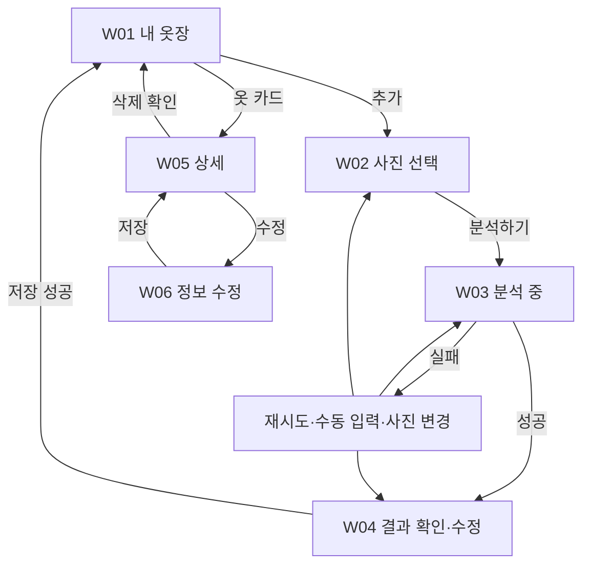

# StyleMate · Wardrobe 디자인 설계

작성일: 2026-09-26 · 수정일: 2026-10-04 · 상태: 공통 앱에 촬영·분석·편집·저장 통합, 로컬 MySQL 연결 확인 · 범위: Android 옷장 기능

## 1. 문서의 기준과 범위

### AR 실측 화면

- 옷장 하단의 `촬영하기`로 진입하며 촬영은 AR 카메라로 통합한다.
- 옷과 주변 바닥을 평평하게 비춘다. 중앙 십자 위치의 수평 평면이 인식되고 추적 중일 때만 촬영할 수 있다.
- 촬영 시 사진과 AR 평면을 함께 고정한다. 미리보기는 HRNet 제안점을 표시하며 기울기 수치는 표시하지 않는다. 촬영 높이는 고정하지 않는다.
- 상의·얇은 아우터·바지와 치수 항목을 선택하고 사진 위 시작점·끝점을 찍는다. 선·점·cm 추정값을 표시한다. 같은 항목을 다시 찍거나 삭제할 수 있다.
- 종류 변경·재촬영 시 기존 측정점을 초기화한다. 끝점을 찍기 전에는 확인할 수 없다. 옷 전체가 같은 평면에 있다고 가정하며, 광선과 평면이 만나지 않는 점은 거부한다.
- 최소 한 항목을 측정하면 사진과 측정값을 기존 확인 화면으로 전달한다. 취소하면 이전에 선택한 사진·측정값을 유지한다.
- 자동 소매길이·인심·총장은 중간점을 잇는 경로로 계산한다. 두꺼운 옷·주름·봉제선의 실제 길이를 보장하지 않는다. 사진 확인 화면의 분석하기로 Gemini 분석을 요청한다. 분석 결과를 수정한 뒤 `옷장에 추가`로 저장한다.

### 분석·편집·저장 화면

- Gemini가 제안한 이름·분류·색상을 바로 수정한다. 종류·핏 등 기존 선택 항목은 `상세 정보`에서 사용자가 입력한다.
- 치수는 소수 둘째 자리까지 표시한다. 미측정 항목은 비워 두며 직접 수정할 수 있다. 치수별 `AR 추정` 문구는 표시하지 않으며 데이터의 측정 출처는 유지한다.
- 폼 맨 아래에 여러 줄 `메모`를 배치한다. 최대 2,000자이며 분석 API에 전송하지 않는다.
- `옷장에 추가` 성공 시 목록으로 돌아가 사진·이름·개수를 갱신한다. 실패하면 입력값과 재시도 버튼을 유지한다.
- 옷장 카드를 누르면 저장한 정보를 수정하고 `저장하기`로 반영한다. 저장 중 중복 요청과 화면 이탈은 막는다.
- 상의 안내에서 래글런·칼라 예외 등 부가 설명은 생략하고 측정할 두 지점만 안내한다.

### 기존 디자인 기준

- 기준 시안: 사용자가 제공한 `[SWPP-2026] design.pdf`의 2페이지 `내 옷장`.
- 다른 페이지의 배경, 색상, 버튼, 카드 형태를 참고하여 앱 전체와 시각적으로 맞춘다.
- 본 문서는 옷장 목록·등록·상세·수정·삭제를 설계한다. 프로필, 홈 추천, 대화, 상품 추천의 상세 설계는 담당하지 않는다.
- 데이터 필드, 허용값, API, 상태 전이는 [wardrobe-spec.md](wardrobe-spec.md)를 기준으로 한다. 두 문서 모두 아직 팀이 승인한 명세나 구현 완료 상태를 의미하지 않는다.
- **시안 확인:** 실제 PDF에서 관찰한 내용. **설계 제안:** 시안에 없는 동작·화면·수치를 보완한 내용. 팀 합의 전까지 변경 가능하다.

## 2. 시안에서 확인한 구성

| 요소 | 시안 확인 | 적용 |
| --- | --- | --- |
| 배경 | 따뜻한 밝은 배경, 흰 카드 | 동일한 색조 유지 |
| 상단 | `내 옷장`, 총 옷 수, 검색 아이콘, 주황색 추가 아이콘 | 실제 저장된 개수 표시, 추가는 등록 화면 진입 |
| 카테고리 | 전체·상의·하의·아우터·신발 | 선택한 항목만 진한 배경과 밝은 글자 |
| 목록 | 3열 그리드, 둥근 카드, 이미지 영역·옷 이름·스타일 | 실제 사진을 카드에 표시 |
| 하단 | 홈·옷장·코디북·마이 | 옷장 선택 상태를 주황색으로 표시 |
| 공통 강조 | 주황색 버튼과 선택 상태 | 주요 행동의 강조색으로 사용 |

시안의 `32벌`, 예시 옷 이름과 색상 블록은 샘플 데이터다. 실제 개수·콘텐츠로 바꾼다. 사진 영역의 티셔츠 아이콘은 시안용 표현으로 보고, 구현에서는 등록한 사진을 우선 표시한다.

프로필 시안의 사이즈 추정, 추천 화면의 배치, 상품 가격 등은 옷장 데이터 요구사항으로 가져오지 않는다. 다른 기능의 정책을 이 문서에서 확정하지 않는다.

## 3. 공통 디자인 기준 — 현재 구현

[체형 기능 설계](../body-analysis/02-design.md)와 `ui/profile/`의 실제 화면을 기준으로 한다. PDF의 근사 토큰 대신 공통 `StyleMateTheme`를 사용하며 별도 글꼴·옷장 테마를 만들지 않는다.

| 역할 | 구현 기준 | 사용 위치 |
| --- | --- | --- |
| 배경 | `background` · `#F8F6F2` | 체형·옷장 화면 |
| 카드 | `surfaceContainer` · `#FFFFFF` | 사진·옷 목록·입력 묶음·치수 요약 |
| 강조 | `primary` · `#C4552B` | 주요 버튼·선택 칩 |
| 보조 배경 | `surfaceVariant` · `#F1ECE6` | 치수 값 배경 |
| 본문 | `onSurface` · `#1F1B18` | 제목·입력값 |
| 보조 글자 | `onSurfaceVariant` · `#8A8580` | 개수·안내·측정 출처 |
| 테두리 | `outlineVariant` · `#E4DED7` | 사진 영역·치수 구분선 |
| 기본 글꼴 | 공통 Material 3 typography·플랫폼 기본 글꼴 | 전체 화면 |
| 탭 화면 제목 | `headlineSmall` · 24sp · Bold | 내 옷장·마이프로필 |
| 등록·편집 상단 제목 | TopAppBar 기본 `titleLarge` · 22sp · Bold | 촬영·사진 확인·결과 편집 |
| 섹션 제목 | `titleMedium` · 16sp · Bold | 기본 정보·치수·상세 정보 |
| 본문·입력 / 안내 | `bodyLarge` · 16sp / `bodyMedium` · 14sp | 입력값·행 라벨 / 안내 |
| 보조 글자 | `bodySmall` · 12sp | 스타일·출처·보조 라벨 |
| 화면 여백 | 좌우 20dp, 탭 제목 위 16dp | 체형·옷장 본문 |
| 카드 | 모서리 16dp, 내부 여백 16dp | 입력 묶음·치수 요약 |
| 입력·보조 버튼 | 모서리 12dp | 텍스트 입력·선택·재촬영 |
| 주요 버튼 | 모서리 16dp, 최소 높이 56dp, 좌우 20dp·상하 12dp 여백 | 하단 고정 행동 |
| 섹션 간격 | 제목 위 20dp·아래 10dp | 공통 SectionTitle |

- `ui/components/ScreenComponents.kt`의 `ScreenScaffold`·`PrimaryActionBar`·`SectionTitle`을 체형과 옷장에서 공유한다.
- 옷장 목록은 공통 탭 영역 안에 배치한다. 등록·편집 화면의 상단바는 시스템 여백을 중복 적용하지 않는다. 키보드가 열려도 저장 버튼에 접근할 수 있게 한다.
- `촬영하기`, `촬영`, `확인`, `분석하기`, `옷장에 추가`·`저장하기`를 각 단계 하단에 고정한다. 사진 확인의 `다시 촬영`은 체형 결과 화면처럼 상단 보조 행동으로 배치한다.
- 편집 본문은 사진 → 기본 정보 → 상세 정보 → 치수 → 메모 순서다. 상세 정보는 접어서 시작한다. 메모가 마지막 입력 항목이다.
- 추정 치수는 체형 결과와 동일하게 흰 카드 안에 라벨·값을 좌우로 배치한다. 의류 치수의 소수점 둘째 자리 표시는 유지한다.
- 카테고리·측정 항목 칩은 체형의 스타일 선택과 같은 캡슐 모양과 강조색을 사용한다.
- 옷 목록은 기본 3열·간격 12dp다. 화면 너비가 352dp 미만이거나 글자 배율이 1.3을 초과하면 2열로 표시한다. 카드 내부 여백은 12dp다. 이름 최대 2줄·보조 정보 최대 1줄을 담는 같은 높이의 영역을 확보하고, 실제 텍스트 묶음을 세로 가운데에 배치한다. 스타일이 없으면 빈 줄을 만들지 않는다. 영역 높이는 공통 글꼴의 줄 높이와 기기 글자 배율을 반영한다.
- 상단에는 전체 옷 수만 표시하며 상시 새로고침 버튼은 두지 않는다. 앱 진입 시 서버 목록을 읽고, 저장 성공 시 응답으로 목록을 갱신한다. 조회 실패 시에만 `다시 불러오기`를 제공한다.
- 촬영 사진은 정사각 미리보기 안에서 Fit으로 표시한다. 측정점 편집은 기존 사진 종횡비와 좌표계를 유지한다.

## 4. 화면 흐름 — 설계 제안

분석 실패 후 수동 입력은 사진 업로드가 성공하여 임시 등록 ID가 있는 경우에만 가능하다. 업로드 자체가 실패하면 다시 업로드해야 한다.

### W01. 내 옷장

- 상단에 `내 옷장`과 **저장된 전체 옷 수**를 표시한다. 필터·검색 결과 수와 혼동하지 않도록 전체 개수는 고정한다.
- 추가 아이콘을 누르면 W02로 이동한다.
- `전체 / 상의 / 하의 / 아우터 / 신발`을 단일 선택한다. 필터는 필요하면 가로 스크롤한다.
- 카드는 사진 → 이름 → 대표 스타일 순서로 표시한다. 스타일이 여러 개면 첫 번째 표시값 뒤에 `외 N`을 붙이고, 없으면 라벨을 생략한다.
- 새로 등록한 옷이 먼저 오도록 정렬한다. 등록 성공 후 필터·검색을 초기화하고 첫 위치에서 새 카드를 보여준다.
- 검색 아이콘을 누르면 상단 검색 입력을 펼친다. 검색 범위는 옷 이름이며 선택한 카테고리와 함께 적용한다. 검색은 후순위이며 미구현 상태로 배포할 때는 무반응 아이콘을 남기지 않는다.
- 이미지 영역은 정사각형으로 제안한다. 옷이 잘리지 않도록 `Fit`으로 표시하고 남는 공간은 중립색으로 채운다.
- 하단 내비게이션의 구성·이동은 앱 공통 담당자가 관리한다. 옷장 기능에서 공통 탭을 중복 구현하지 않는다.

### W02. 사진 선택

- 상단: 뒤로가기, `옷 추가`.
- 본문: `옷 한 벌이 전체적으로 보이는 사진을 선택해 주세요.`와 사진 영역.
- 행동: `사진 촬영`, `갤러리에서 선택`. 선택 후 미리보기·`사진 변경`·하단 `분석하기`를 표시한다.
- 사진이 없거나 지원하지 않는 파일이면 분석 버튼을 비활성화하고 이유를 표시한다.
- 촬영·선택 취소 시 기존 선택을 유지한다. 권한이 필요한 경우 거부 이유와 갤러리 선택 등 가능한 대안을 안내한다.
- 이터레이션 1은 한 번에 옷 한 벌·사진 한 장을 등록한다. 일괄 등록·배경 제거 편집은 포함하지 않는다.

### W03. 분석 중

- 사진 미리보기와 진행 표시, `옷의 특징을 분석하고 있어요`를 표시한다. 실제 진행률을 알 수 없으므로 임의의 진행률 수치는 표시하지 않는다.
- 중복 분석 요청을 막는다. 뒤로가기 시 떠난 화면에 뒤늦은 응답이 표시되지 않도록 한다. 화면 이탈이 서버 처리 취소를 보장하지는 않는다.
- 실패 시 `사진 분석에 실패했어요`와 재시도·사진 변경을 제공한다. 업로드가 완료됐다면 `직접 입력`도 제공한다.

### W04. 분석 결과 확인·수정

- 상단: `옷 정보 확인`. 사진, `AI가 제안한 정보예요. 다른 부분은 수정해 주세요.` 안내, 편집 폼을 배치한다.
- 기본 정보: 이름 → 카테고리 → 종류 그룹 → 색상 → 스타일. 상세 종류 검색은 선택용 프리셋으로 제공하고, 선택값을 종류 그룹과 개별 속성에 반영한다. 종류는 [옷 종류 사전](wardrobe-types.md)의 한국어 이름으로 검색하고, 세부 종류가 불명확한 경우 해당 항목의 입력을 생략할 수 있다.
- `디자인 특징` 접이식 영역: 종류·스타일·디자인 핏·소매·하의 형태·밑위 디자인 등 적용 가능한 속성만 표시한다. AI 제안 항목은 요약 칩으로 우선 표시한다.
- `실측 치수(선택)` 접이식 영역: cm 단위, 부위별 측정 그림·시작점 안내·출처(직접 측정/상품 치수표)를 제공한다. 선택 사이즈 입력은 제공하지 않는다. 치수표 출처 메모는 선택이며 측정 경로를 모르면 미확인으로 기록한다. 상의 밑단·소매부리·암홀을 포함하고, 미제공 값(-)은 빈 값으로 처리한다. 신발에는 의류 치수 입력을 표시하지 않는다. 사진 분석으로 cm 값을 자동 생성하지 않는다.
- **필수값은 이름·카테고리**다. 선택 항목은 미확인 상태로 저장할 수 있다. AI가 추정하지 못한 값은 `선택 안 함`으로 표시한다.
- 선택 항목·카테고리별 적용 규칙은 [기준정보](wardrobe-spec.md#3-특징-기준정보)를 따른다.
- 카테고리·종류를 바꾸면 세부 속성·치수의 유효성을 다시 검사한다. 유효한 값은 유지하고, 초기화 대상에 사용자 입력값이 포함된 경우 확인 후 적용한다.
- 특징의 출처는 `AI 제안` 또는 `사용자 입력`, 실측은 `직접 측정` 또는 `상품 치수표`로 표시한다. 항목별 확인 버튼은 제공하지 않는다. 편집 없이 저장하면 AI 제안 출처를 유지한다.
- 프리셋 선택 후 속성이 변경되면 상세 종류 표시명을 다시 구성한다. 저장되지 않는 프리셋과의 충돌 확인 화면은 제공하지 않는다. category·subcategory별 속성 적용 범위는 검증한다.
- 하단 주요 행동은 `옷장에 저장`. 저장 중 중복 입력을 막고 실패 시 수정 중인 값을 유지한다.
- 저장 성공 시 W01로 돌아가 `옷장에 저장했어요`를 표시한다. 저장되지 않은 수정값을 버리고 나갈 때만 이탈 확인을 표시한다.

### W05·W06. 상세·수정·삭제

- 카드를 누르면 큰 사진, 옷 이름, 한국어 종류명, 저장된 특징을 표시한다. 상세 특징·실측은 그룹으로 나누고 미입력 그룹은 요약한다. 실측은 cm 값을 표시하고 출처·측정 방법은 데이터에 유지한다.
- `수정`은 W04와 같은 폼을 재사용하지만 AI를 다시 호출하지 않는다. 이터레이션 1의 저장 후 수정 범위는 특징 정보이며 사진 교체는 제외한다.
- 삭제 시 `이 옷을 옷장에서 삭제할까요?` 확인 후 실행한다. 실패하면 상세 화면과 데이터를 유지한다.
- 추천 기능에서 삭제된 옷을 참조하는 정책은 추천 담당자와 합의한다. 삭제 직후 새 추천에는 포함되지 않아야 한다.

## 5. 공통 화면 상태

| 상황 | 표시·행동 |
| --- | --- |
| 목록 최초 로딩 | 카드 자리 표시 또는 진행 표시 |
| 옷장이 비어 있음 | `아직 등록한 옷이 없어요` + `첫 옷 추가하기` |
| 필터·검색 결과 없음 | `조건에 맞는 옷이 없어요` + `조건 초기화` |
| 목록 조회 실패 | 오류 안내 + 재시도, 기존 목록이 있으면 유지 |
| 사진 조회 실패 | 대체 이미지와 이름 표시, 카드의 상세 진입 유지 |
| 네트워크·분석·저장 실패 | 어느 단계가 실패했는지 구분, 가능한 재시도 제공 |
| 앱 재실행 | 서버에서 확정 저장된 옷 조회. 저장 전 초안의 재실행 복구는 이터레이션 1 범위 밖 |

## 6. 구현 우선순위와 연결 경계

1. W01 최소 목록 + W02~W04 등록 흐름을 모의 응답으로 연결한다.
2. 실제 분석·저장·조회 API를 연결하여 등록 후 앱 재실행까지 검증한다.
3. W05·W06 및 삭제를 구현한다.
4. 이름 검색·세부 시각 조정을 진행한다.

Android 소스는 팀 Android 프로젝트의 wardrobe 패키지, Django 소스는 `backend` 아래 wardrobe 앱에 둔다. 실제 패키지·프로젝트 경로는 기본 세팅 담당자가 정한 구조를 따른다. `docs/wardrobe/`는 문서만 관리한다.

옷장 기능의 담당 컴포넌트는 옷 카드, 카테고리 필터, 사진 선택 영역, 특징 입력 폼, 옷장 화면 상태다. 공통 테마·내비게이션·네트워크 클라이언트·사용자 식별을 별도 구현하기 전에 담당자와 구현 범위를 합의한다.

## 7. 디자인 검증 기준

- [ ] 목록은 원본 시안의 색조·카드 계층·카테고리·선택 상태를 유지한다.
- [ ] 실제 옷 사진이 과도하게 잘리지 않고 긴 이름도 레이아웃을 깨지 않는다.
- [ ] 작은 화면·글자 확대·키보드 표시 중에도 필수 입력과 저장 버튼에 접근할 수 있다.
- [ ] 빈 목록·필터 결과 없음·실패·로딩을 구분한다.
- [ ] 사용자가 AI 결과를 수정할 수 있고 저장 실패 시 입력값을 잃지 않는다.
- [ ] 뒤로가기·선택 취소·중복 탭으로 의도하지 않은 등록이 일어나지 않는다.

## 8. 유지보수 규칙

- 화면·동작 변경은 이 문서, 필드·허용값·API 변경은 `wardrobe-spec.md`에 반영한다. 양쪽에 영향을 주면 같은 PR에서 수정한다.
- 기준정보를 바꿀 때 FE 표시값, BE 검증, AI 출력 규격, 추천 기능의 소비 코드를 함께 확인한다. 종류의 코드·표시명 변경은 `wardrobe-types.md`에도 반영한다.
- 시안 변경 시 파일명과 페이지, 변경 내용을 기록한다. PDF 원본은 현재 이 저장소에 포함되어 있지 않다.
- 팀 승인 전에는 문서의 `설계 제안`을 확정 요구사항으로 취급하지 않는다.

| 날짜 | 변경 |
| --- | --- |
| 2026-09-26 | PDF 옷장 시안을 기준으로 초기 설계 및 등록 흐름 제안 |
| 2026-10-04 | 착용 정보·일부 상세 속성·누끼 제거, 촬영·치수 안내 간소화 |

변경 이력: 2026-10-04 — 입력 항목 축소, 체형 화면과 공통 레이아웃 적용.

## 현재 로컬 구현 범위

`frontend/`는 내 옷장 빈 화면, 전체 수, 카테고리 필터·카드 구성과 촬영 버튼을 제공한다. 버튼을 누르면 권한 확인 후 앱 AR 카메라가 열리며 촬영 결과 확인·재촬영·삭제가 가능하다. 취소한 재촬영은 이전 사진을 유지한다. 권한 거부 시 재요청 설명 또는 앱 설정 이동을 제공한다.

목록은 PC 서버에 저장한 옷과 사진을 표시한다. Gemini 분석 결과를 수정하고 치수·메모를 저장할 수 있으며, 목록 카드를 눌러 재수정할 수 있다. 갤러리·삭제·공통 하단 탭은 후속 범위다. 단계별 구현 여부는 [데이터 흐름](wardrobe-flow.md)을 따른다.

촬영 화면에서 반팔·긴팔·반팔 아우터·긴팔 아우터·바지·반바지·스커트 또는 `직접 지정`을 선택한다. 자동 탐지 중에는 제안점·연결선을 미리보기에 표시한다. 촬영 후 원본 사진으로 HRNet을 다시 실행하여 점을 표시한다. 배경 제외 스위치와 누끼 처리는 제공하지 않는다. 사용자가 직접 수정한 치수는 재탐지로 덮어쓰지 않는다. 이후 사용자는 점을 확인하고 원하는 항목의 두 점을 다시 찍어 수정할 수 있다. 탐지 실패·미지원 항목은 직접 지정한다. 자동 제안이 있어도 `확인`을 눌러야 다음 단계로 넘어간다. 치수는 `추정 치수`로 표시하고 소수 둘째 자리까지 반올림한다.
