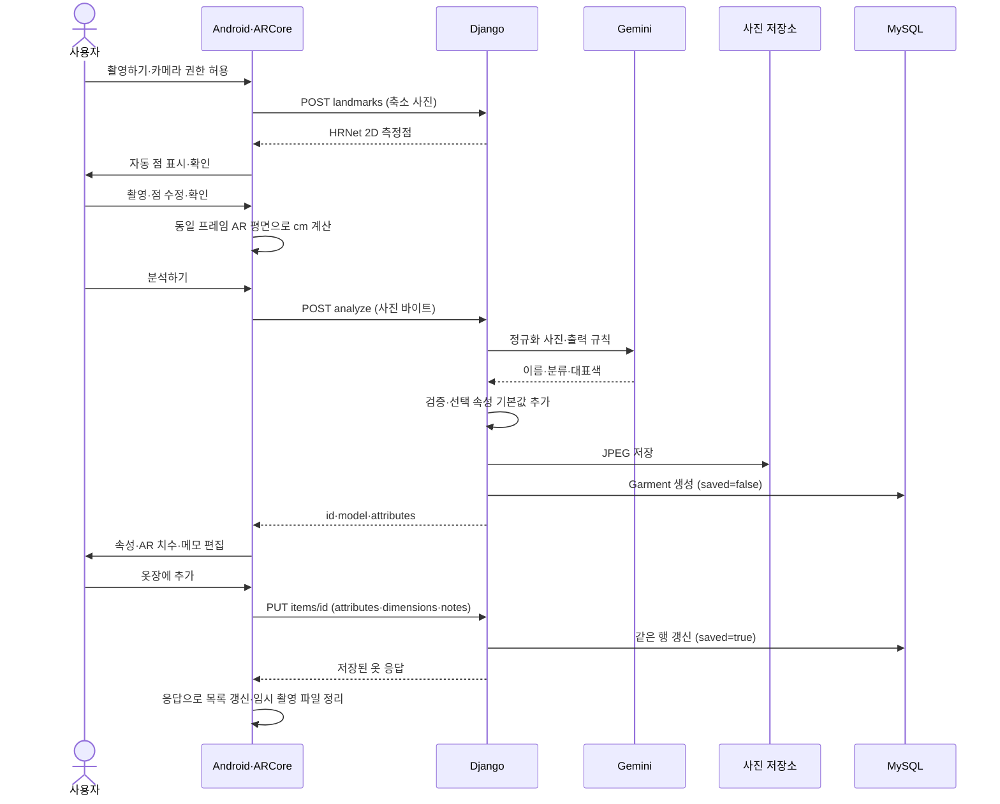

# 옷장 데이터 흐름

수정일: 2026-10-05 · 기준: 현재 구현

## 1. 역할과 저장 위치

| 구성요소 | 역할 |
| --- | --- |
| Android | 카메라 권한, AR 촬영·cm 계산, 점 확인·수정, 사진 픽셀 색상 선택, 편집·저장 요청 |
| Django | 이미지·JSON 검증, HRNet 추론, Gemini 호출, 초안·옷 조회·수정 |
| Gemini | 이름·상위 분류·대표색 1~2개 생성 |
| MySQL | 단일 Garment 테이블에 속성·치수·메모·사진 경로·저장 상태 관리 |
| 서버 파일 저장소 | 정규화 JPEG 보관. 배포에서는 사진 영구 볼륨 필요 |

DB와 파일 저장소가 확정 데이터의 기준이다. Android 사진·편집 상태는 캐시·화면 상태이며 독립적인 원본 옷장 DB가 아니다. API 키는 서버에만 둔다. 사용자 식별·S3·추천은 미구현이다.

## 2. 등록·저장 순서

앱 진입 시 GET options와 GET items로 편집 기준·저장 목록을 읽는다. 목록은 saved=true만 포함하고, 카드 선택 시 해당 데이터로 편집한다. 저장된 옷도 동일 PUT으로 수정한다. 사진은 GET items/id/image로 읽는다.

## 3. 촬영·측정

촬영 버튼을 누를 때 카메라 권한을 확인한다. 거부 시 설명·설정 이동을 제공하며 목록 접근은 유지한다. 촬영은 앱 내부 ARCore 카메라를 사용하며 갤러리 선택은 없다.

HRNet은 원본 사진의 2D 측정점 경로를 반환한다. Android는 사진·카메라 행렬·수평 평면을 같은 프레임에서 고정하고 경로의 점들을 AR 평면에 투영하여 구간 길이를 합산한다. 고정 높이와 기준 물체는 사용하지 않는다. 옷이 바닥 평면과 같다는 가정이므로 실제 치수 정확도는 별도 검증 대상이다.

미리보기는 500ms 간격으로 확인하고 동시 한 요청만 보낸다. 1.2초보다 늦거나 종류·화면·카메라 위치가 바뀐 응답은 사용하지 않는다. 통신 실패 후에는 3초 간격으로 재시도한다. 촬영 후 고정 사진에서 재탐지하며, 사용자가 직접 수정한 항목은 자동 결과로 덮어쓰지 않는다. 탐지 실패 시 직접 점을 지정할 수 있다.

측정점·촬영 프레임 메타데이터는 화면 간 전달에만 사용한다. 서버에는 최종 dimensions와 출처만 저장하며 Gemini에는 점을 합성하지 않은 사진을 보낸다. 촬영 종류와 Gemini 분류가 다르면 앱에서 안내한다.

## 4. 분석·편집

분석 요청은 동기 처리다. 서버는 DB 설정을 먼저 확인한 뒤 이미지 검증·Gemini 호출·사진 및 초안 저장을 수행한다. 실패한 분석을 저장하는 별도 상태 모델은 없다. 서버 프로세스당 분석·점 탐지 한 건만 처리하며 추가 요청에는 429를 반환한다.

AI는 name·category·colors만 생성한다. 나머지 선택 속성은 null 또는 []로 초기화하고 사용자가 입력한다. 최초 AI 결과의 별도 복사본이나 표시용 display 응답은 저장·전달하지 않는다. 화면 표시는 options의 한국어 라벨·색상표를 사용한다.

사진 색상 선택은 Android가 화면 좌표를 사진 픽셀에 매핑하여 HEX를 얻는다. 추가 AI 호출 없이 편집값으로 저장한다. 메모는 맨 아래 입력하며 AI에 전송하지 않는다.

AR 치수를 변경하지 않으면 출처·방법을 유지한다. 사용자가 숫자를 바꾸면 user_measured·unspecified·reference=null로 보낸다. 카테고리 변경 시 치수를 초기화하고, 종류 변경 시 적용 불가능한 치수·속성을 제거한다.

## 5. 실패·재시도와 수명

| 상황 | 현재 동작 |
| --- | --- |
| 촬영 취소 | 새 임시 파일 정리, 이전 사진 유지 |
| 점 탐지 실패 | 직접 점 지정 가능 |
| Gemini 분석 실패 | 사진 유지, 재시도·재촬영 가능. 분석 없이 새 옷 저장하는 흐름은 없음 |
| 분석 응답 유실 | 완료된 초안이 남을 수 있음. 분석 재시도는 새 초안을 만들 수 있음 |
| 저장 실패 | 편집값 유지, 같은 ID로 PUT 재시도 |
| 저장 응답 유실 | 같은 ID로 다시 PUT하면 동일 행 갱신. 옷이 추가 생성되지 않음 |
| 목록 조회 실패 | 오류·다시 불러오기 제공 |
| 앱 재실행 | 서버에서 확정 목록 재조회. 미저장 편집 복원은 보장하지 않음 |

앱 촬영 캐시는 24시간을 기준으로 오래된 파일을 정리한다. 서버 초안·사진에는 자동 만료·정리 작업이 없다. 사진 저장 후 DB 생성 실패 시 사진 삭제를 시도한다. 사용자별 접근 제어·옷 삭제·분석 요청 중복 방지 키·동시 편집 충돌 제어는 미구현이다.

API 필드·한도·오류 코드는 [데이터 명세](wardrobe-spec.md), 실행과 검증 명령은 [실행 안내](local-development.md)를 따른다.
