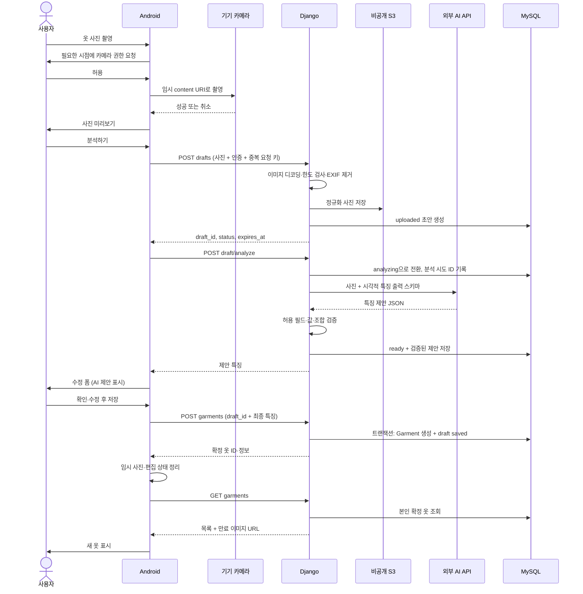

# 옷장 등록 데이터 흐름

기준일: 2026-10-04 · 상태: 로컬 촬영·Gemini 분석·편집·MySQL 저장·조회 구현, S3·사용자 식별은 설계 단계

## 1. 범위와 현재 상태

사진 한 장으로 옷 한 벌을 등록한다. 전체 흐름은 **촬영 → 업로드 → AI 제안 → 사용자 확인·수정 → 저장 → 옷장 조회**다. AI 분석이 끝났다는 이유만으로 옷을 확정 저장하지 않는다.

| 구간 | 현재 로컬 구현 |
| --- | --- |
| 촬영 | AR 카메라·측정점·미리보기, 치수 두 자리 표시 |
| 분석 | Django → Gemini 이름·분류·색상 → 스키마 검증 → MySQL 초안·로컬 사진 보관 |
| 편집 | 특징·치수 수정, 하단 메모 입력 |
| 저장 | 같은 초안 ID의 PUT 요청으로 확정, 실패 시 입력 유지·재시도 |
| 목록 | 저장한 옷만 서버 조회, 사진 표시, 카드에서 재수정 |
| 미구현 | 사용자 식별, S3, 옷 삭제, 초안 자동 정리 |

사진은 `backend/private/wardrobe-media/`, 옷 데이터는 MySQL Garment 테이블에 보관한다. 초안은 saved=false이고 최종 저장 시 saved=true로 변경한다. 테이블은 마이그레이션으로 생성하며, 옷마다 새 DB나 테이블을 만들지 않는다. 로컬 API 계약은 [wardrobe-spec.md](wardrobe-spec.md)의 적용 범위를 따른다.

필드·허용값·오류 형식의 기준은 [wardrobe-spec.md](wardrobe-spec.md), UI 기준은 [design.md](design.md)다. 이 문서는 구성요소 간 처리 순서와 실패 복구를 설명한다.

## 2. 팀 통합 설계: 구성요소별 책임과 저장 위치

| 구성요소 | 처리 | 저장·전달 데이터 |
| --- | --- | --- |
| 사용자 | 한 벌 촬영, AI 결과 검토, 필수값 보완, 저장 결정 | 이름·종류 수정, 선택 실측·메모 입력 |
| Android | 권한·촬영·미리보기·폼·로딩·실패 표시, Django 호출 | 촬영 파일은 앱 전용 캐시, 편집 중 값·draft ID는 임시 상태 |
| Django | 소유권·입력 검증, 이미지 정규화, S3·AI 호출, 저장 트랜잭션 | 서버가 ID·owner·출처·시간 결정 |
| 외부 AI | 사진과 제한된 출력 스키마를 받아 시각적 특징 제안 | 검증 전 출력은 신뢰하지 않음 |
| 비공개 S3 | 정규화한 옷 사진 저장 | 사진 파일, 임의 객체 키. 공개 버킷 금지 |
| MySQL | 초안 상태·제안·확정 특징·사진 키 저장 | GarmentDraft, Garment, 공통 익명 사용자 참조 |
| 추천 기능 | 확정된 본인 옷과 별도 체형 프로필 조회 | draft·미입력 치수를 확정 정보로 사용하지 않음 |

영구적인 옷 JSON과 체형 JSON의 기준은 서버 DB다. Android 전체 옷장 JSON 파일을 원본 DB처럼 관리하지 않는다. 체형 데이터는 프로필 담당 모델에 두고 이 기능에서 복제하거나 AI에 전송하지 않는다. 앱에는 AI 키·S3 자격 증명을 넣지 않는다.

로그인 화면이 없어도 사용자를 구분한다. 공통 서버의 익명 세션 발급 API가 임의 토큰을 발급하고 서버는 해시를 보관하는 방식을 제안한다. 앱은 Android Keystore로 보호한 저장소에 토큰을 보관하고 HTTPS 요청에 전달한다. 서버는 인증 문맥에서 owner를 결정하며 요청 JSON의 owner_id를 받지 않는다. 발급 경로·만료·복구는 공통 BE와 합의할 사항이다. 토큰 유실 시 자동으로 새 사용자를 생성해 기존 옷장이 사라진 것처럼 보이지 않게 한다. 현재 로컬 Probe·Wardrobe API에는 이 인증이 없으며 PC 루프백에서만 사용한다.

## 3. 정상 처리 순서

아래 다이어그램은 팀 통합 시의 분리된 draft·S3 계약이다. 현재 로컬 구현은 analyze 요청에서 단일 Garment 초안을 만들고, items/{id} PUT으로 같은 레코드를 확정 저장한다. 사진 저장소는 S3 대신 프로젝트 전용 로컬 디렉터리다.

### 촬영과 사용자 인터페이스

1. 앱 진입 시 권한을 요청하지 않는다. 사용자가 촬영 버튼을 누를 때 현재 권한을 확인한다.
2. 최초 요청, 재요청 설명, 시스템이 요청창을 더 이상 보여주지 않는 경우의 설정 이동을 구분한다. 거부해도 옷장 조회를 막지 않는다. 설정에서 돌아오면 촬영 버튼을 다시 눌러 권한을 재검사한다.
3. 촬영하기는 MeasurementActivity의 앱 내부 ARCore 카메라를 연다. 사진·평면을 고정한 뒤 사용자가 두 점으로 치수를 측정한다. 카메라 권한과 AR 서비스가 필요하며 갤러리·공유 저장소 권한은 요청하지 않는다.
4. 파일명과 촬영 대기 상태는 화면 재생성에 유지한다. 취소·실패 시 새 임시 파일을 삭제하고 이전 사진은 유지한다. 성공한 재촬영만 이전 사진을 대체한다.
5. 미리보기는 큰 원본을 그대로 UI 메모리에 올리지 않고 축소 디코딩하며 EXIF 방향을 적용한다. 돌아가기·삭제는 미저장 사진을 제거한다. 앱 캐시가 OS에 의해 제거될 수 있으므로 파일이 없으면 재촬영을 안내한다. 남겨진 캐시는 다음 옷장 진입 때 24시간 기준으로 정리한다.
6. `분석하기`를 누르면 사진을 POST /api/wardrobe/analyze/로 전송하고 Django가 Gemini gemini-3.1-flash-lite를 호출한다. 시각적 속성과 한글 결과를 표시하며 AR 측정값은 유지한다. 현재 로컬 API는 분석 결과·사진을 MySQL 초안과 로컬 파일로 보관한다. 편집·저장은 구현되었으며 갤러리 선택·S3는 후속 범위다.

### 업로드와 초안

- `POST /api/wardrobe/drafts/`: multipart `image`. 서버는 파일 크기·실제 형식·픽셀 수를 검사하고 위치 메타데이터를 제거한다. 수치는 기준 명세 7절을 따른다.
- S3 저장 성공 뒤 초안 행을 만든다. 이미지 키는 서버가 생성한다. DB 생성 실패 시 방금 만든 객체를 삭제하고, 삭제 실패는 정리 작업에서 추적한다.
- 사진 선택만으로는 서버 초안이 존재하지 않는다. 업로드 성공 후에만 draft ID를 사용한다. 확정 목록에는 초안을 포함하지 않는다.
- 업로드 버튼 중복 클릭을 막는다. 응답 유실에 대비해 클라이언트가 업로드당 UUID `Idempotency-Key`를 만들고 같은 파일 재시도에 재사용한다. BE는 `(owner, key)` 고유 제약과 파일 해시를 확인한다. 같은 요청이면 기존 초안을 반환하고 다른 파일이면 409를 반환한다. 이미 생긴 중복 임시 객체는 정리한다. 초기 201, 재전송 200으로 제안한다.

### AI 분석

- Django에서만 Gemini를 호출한다. 선택 사진의 정규화 바이트만 보내며 체형·접근 토큰·다른 옷장 사진은 보내지 않는다. 키는 backend/.env에서 읽고 Android로 전달하지 않는다.
- 입력은 `정규화 이미지 + schema_version + 허용 분류/속성 + 출력 규칙`이다. 이미지 속 문구는 분석 대상이며 지시문으로 실행하지 않는다. 여러 옷·옷 없음·미지원 범주를 구분한다.
- 출력은 [명세 3.7절](wardrobe-spec.md)의 시각적 필드만 허용한다. 불확실한 값은 null/빈 배열로 두며, 소재·촉감·신축성·비침·두께·계절·cm 실측·소유자·사진 키는 받지 않는다. 금지·알 수 없는 필드나 잘못된 값은 결과 전체를 검증 실패로 처리하고 수동 입력 또는 재시도로 안내한다.
- AI가 JSON을 반환했더라도 서버가 종류 종속성, 필드 타입, 허용값, 배열 개수, 텍스트 길이를 다시 검사한다. 검증된 값만 suggested_attributes에 넣는다. AI 원문을 최종 옷 레코드로 복사하지 않는다.
- 분석 상태 선점만 짧은 DB 트랜잭션으로 처리하고 외부 호출 중 DB 행 잠금을 유지하지 않는다. attempt_id와 분석 시작 시각을 기록하여 현재 시도의 응답만 조건부 반영한다. 같은 초안의 동시 분석은 409다.
- 로컬 구현은 동기 요청이며 공급자 소켓 timeout 30초, 앱 연결 timeout 5초·읽기 timeout 45초다. 서버의 동시 분석은 1건으로 제한하며 자동 재시도하지 않는다. 영속 초안의 분석 회수·운영 비용 상한은 정식 API에서 추가할 사항이다.
- 원문 사진·토큰·서명 URL을 로그에 남기지 않는다. 요청 ID·모델 버전·시간·성공/오류 코드만 운영 진단에 기록한다. 이미지 보관·학습 사용·삭제 조건은 제공자 선택 시 확인할 미정 항목이다.

### 확인과 최종 저장

- 분석 성공 후 사용자는 이름·카테고리를 확정한다. 실측·상세 속성·메모는 선택 입력이다. 사용자 수정 시 출처를 서버가 user_entered로 계산하며, 수정하지 않은 AI 제안은 ai_suggested로 유지한다.
- `POST /api/wardrobe/garments/`는 draft_id와 최종 필드를 받는다. 서버는 소유자·초안 만료·상태·필수값·적용 범위를 확인한다. 클라이언트가 서버 관리 필드를 지정하면 거부한다.
- DB 트랜잭션 안에서 초안을 잠그고 Garment를 생성하며 초안을 saved로 연결한다. draft당 Garment 하나의 고유 제약을 둔다. S3 객체 키를 재사용한다.
- 저장 응답이 유실되면 같은 draft로 재요청한다. 이미 저장됐다면 기존 Garment를 200으로 반환한다. 재요청 값으로 덮어쓰지 않는다. 사용자가 추가 변경을 원하면 PATCH한다.
- 저장 성공 후 임시 로컬 사진을 지우고 목록 필터를 전체로 초기화하여 재조회한다. 목록에는 GET으로 확인된 서버 레코드만 표시한다. 로컬 화면 추가만으로 저장 성공을 표시하지 않는다.

## 4. 상태·복구와 정리

| 사건 | 서버·데이터 처리 | 사용자에게 제공할 행동 |
| --- | --- | --- |
| 권한 거부·카메라 없음 | 서버 변화 없음 | 재요청 설명·설정 이동·목록 유지 |
| 촬영 취소 | 새 파일만 삭제, 이전 선택 유지 | 재촬영·목록 복귀 |
| 업로드 실패·네트워크 끊김 | draft ID 미확정, 동일 업로드 키로 조회/재시도 | 사진 유지, 재시도 |
| 분석 실패·시간 초과 | analysis_failed, 사진·초안 유지 | 재분석·수동 입력·사진 변경 |
| 분석 응답 유실·앱 재진입 | GET draft로 uploaded/analyzing/ready/analysis_failed/saved 확인 | 최신 상태로 복구, 중복 AI 호출 방지 |
| 서버 프로세스 중단 | 분석 lease 만료 시 해당 attempt만 failed 전환 | 재시도 가능하게 복구 |
| 필수 입력 누락 | 400, 저장 안 함 | 해당 필드 오류 표시 |
| 최종 저장 응답 유실 | 동일 draft 재저장 시 기존 Garment 반환 | 목록 복구 |
| 초안 만료 | 410, 저장·분석 금지 | 사진 재등록 |
| 다른 사용자의 ID | 소유권 검증 후 404 | 접근 불가, 존재 여부 노출 안 함 |
| 이미지 URL 만료 | 목록·상세 API에서 새 URL 발급 | 카드 이미지 다시 로드 |

복구용 `GET /api/wardrobe/drafts/{id}/`를 명세에 추가한다. 응답은 draft_id, status, expires_at, attributes(ready일 때), error_code(실패 시), garment_id(saved일 때)다. 만료·소유권을 검사하고 AI 응답 원문은 반환하지 않는다. 후속 FE는 서버에 업로드한 draft ID와 편집 중 입력을 앱 전용 저장소에 임시 보관하고 복귀 시 서버와 대조한다. 현재 촬영부의 rememberSaveable은 이 영속 복구 기능을 대신하지 않는다.

미저장 초안은 24시간 만료를 제안한다. 정리 작업은 활성 분석·저장 트랜잭션과 경합하지 않게 상태를 확인하고 임시 객체와 초안을 정리한다. saved 초안의 사진은 확정 옷이 사용하므로 만료 삭제하지 않는다. 사진 변경은 새로운 초안을 만들고 이전 초안은 만료 정리에 맡긴다. 옷 삭제는 DB에서 조회·추천 대상 제외를 확정하고 S3 삭제를 재시도한다. DB와 S3가 하나의 원자적 트랜잭션이라고 가정하지 않는다. 정리 작업 실행 위치·주기는 인프라 담당과 결정한다.

## 5. 구현 순서와 인수 기준

현재 로컬 앱의 실측 순서는 `ARCore 수평 평면 인식·HRNet 측정점 미리보기 → 동일 프레임 사진·카메라 행렬·평면 고정 → 원본 사진 HRNet 재탐지 → letterbox 좌표 복원 → 광선/평면 교점의 구간 거리 합산 → 사용자 확인·수정`이다. 자동 항목은 [스키마](wardrobe-spec.md)의 로컬 탐지 계약을 따른다. 고정된 촬영 높이나 기준 물체는 사용하지 않는다.

임시 결과 JSON은 category, dimensions 및 measurement_capture를 포함한다. measurement_capture는 frame_timestamp_ns, tilt_degrees, width, height, points_normalized(0~1 좌표의 경로), validated_accuracy=false를 담는다. source는 arcore_manual 또는 arcore_assisted다. 이 공간 메타데이터는 화면 간 전달용이며 현재 DB는 최종 치수와 출처만 저장한다. 촬영 원본에 점을 합성하지 않으며 Gemini에는 원본 사진을 전송한다.

미리보기는 최대 500ms마다 한 장, 동시 한 요청이며 긴 변 768px로 축소한다. 1.2초보다 늦거나 이전 종류·화면의 결과는 폐기한다. 요청 후 카메라가 2cm 이상 이동하거나 약 3도 이상 회전하면 결과를 표시하지 않는다. 네트워크 오류 후 3초 간격으로 재시도한다. 촬영 후에는 진행 중 미리보기 요청을 기다린 뒤 같은 고정 사진으로 다시 탐지한다. 자동 점을 직접 수정한 항목은 재탐지로 덮어쓰지 않는다. 실패 시 직접 지정할 수 있다.

AR 공간 정보와 사진은 같은 프레임에서 고정한다. 옷 전체가 인식된 바닥과 같은 평면에 있다고 가정하여 관측 평면 다각형 밖에도 평면식을 적용한다. 화면 회전·프로세스 종료로 Activity가 재생성되면 새 촬영부터 시작한다. 수학적 계산 검증과 기기 AR 추적 성능 검증은 구분하며 상세는 [실행 안내](local-development.md)를 따른다.

1. 현재 단계: 옷장 빈 화면·필터·카드, 촬영 버튼, 권한 허용/거부, 사진 미리보기·재촬영·삭제. 기기 카메라로 만든 사진은 옷장 카드가 되지 않아야 한다.
2. 공통 기반: 익명 사용자 계약·API 오류 형식·S3 비공개 접근·환경변수·MySQL 마이그레이션 합의. 로컬 테스트용 단일 사용자 우회는 공용 서버에 반영하지 않는다.
3. 업로드·초안·조회 API: 실제 이미지 검증, 소유권, 업로드 중복 요청, S3/DB 중간 실패와 정리 검사.
4. AI 어댑터·분석 API: 정상 JSON, 잘못된 값, 금지 필드, 여러 옷, 타임아웃, 동시 요청, 오래된 응답을 검증한다. 대표 실제 옷 사진으로 사용자 수정 부담도 평가한다.
5. 편집 폼·저장·목록 API: 수정 반영, null 처리, 초안당 단일 저장, 다른 사용자 접근 차단, 앱 재실행 후 동일 목록 확인.
6. 실제 Android → Django → 외부 AI → S3/MySQL 통합 검사. 현재 Probe 테스트 통과를 옷장 등록 전체 완료로 간주하지 않는다.

## 참고 근거

- [Android 런타임 권한](https://developer.android.com/training/permissions/requesting): 사용자 행동 시 권한 요청, 설명·거부 처리.
- [Activity Result](https://developer.android.com/training/basics/intents/result): Activity 재생성에도 결과 수신을 등록하고 추가 상태는 별도 보관.
- [TakePicture](https://developer.android.com/reference/androidx/activity/result/contract/ActivityResultContracts.TakePicture): 지정한 URI에 사진을 기록하는 계약.
- [FileProvider 파일 공유](https://developer.android.com/training/secure-file-sharing): content URI와 임시 접근 권한으로 앱 파일 공유.
