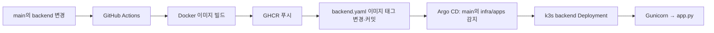
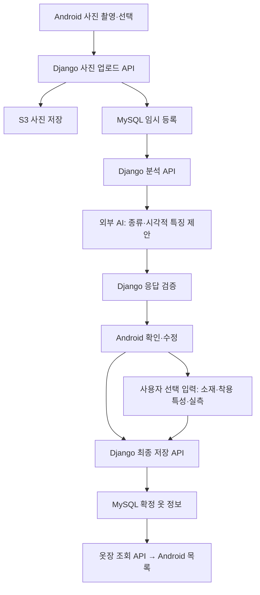

# StyleMate 구조 및 파일 역할

기준일: 2026-09-26 · 범위: 현재 작업 트리 · 상태: 배포용 최소 서버 및 옷장 설계 문서

## 1. 현재 구현 상태

현재 실행 코드는 단일 파일 Django 데모 서버다. Android 프로젝트, 옷장 API·모델, MySQL·S3 연결, AI 분석, 사용자 식별은 아직 구현되지 않았다. 인프라 설정 파일은 존재하지만 실제 Azure VM·클러스터·GitHub Actions의 실행 상태는 이 문서만으로 확인할 수 없다.

문서 파일은 현재 로컬 작업 트리를 기준으로 포함한다. 파일이 아래에 있다는 사실이 GitHub 반영이나 팀 승인을 의미하지 않는다.

## 2. 현재 디렉터리 구조

```text
swpp-2026-project-team-14/
├─ AGENTS.md
├─ README.md
├─ .github/
│  └─ workflows/
│     └─ backend-release.yaml
├─ backend/
│  ├─ app.py
│  ├─ requirements.txt
│  └─ Dockerfile
├─ document/
│  ├─ architecture.md
│  ├─ design.md
│  ├─ wardrobe-spec.md
│  └─ wardrobe-types.md
└─ infra/
   ├─ apps/
   │  ├─ namespace.yaml
   │  └─ backend.yaml
   └─ argocd/
      └─ team14.yaml
```

`.git/` 등 내부 관리 데이터와 생성 산출물은 제외한다. 파일 목록 관리 기준은 [AGENTS.md](../AGENTS.md)를 따른다.

## 3. 디렉터리별 책임

| 디렉터리 | 책임 | 현재 범위 |
| --- | --- | --- |
| 루트 | 프로젝트 안내·작업 규칙 | README 템플릿, 프로젝트 전용 AGENTS 지침 |
| `.github/workflows/` | GitHub Actions 자동화 | backend 이미지 빌드·푸시 및 배포 이미지 갱신 |
| `backend/` | Django 서버와 이미지 빌드 입력 | 데모 HTTP 응답과 Gunicorn 실행 |
| `document/` | 기능 설계·기준정보·구조 설명 | 옷장 기능 중심 설계 문서 |
| `infra/apps/` | 클러스터에 적용할 애플리케이션 리소스 | Namespace, backend Deployment·Service |
| `infra/argocd/` | Git과 클러스터를 연결하는 Argo CD 설정 | Application 리소스 |

## 4. 파일별 역할

| 파일 | 역할·연결 |
| --- | --- |
| [AGENTS.md](../AGENTS.md) | 이 저장소 작업 지침. 구조 변경 시 본 문서의 동시 갱신을 요구한다. |
| [README.md](../README.md) | 과제 저장소의 기본 안내 템플릿. 실제 앱 실행 안내는 아직 작성되지 않았다. |
| [.github/workflows/backend-release.yaml](../.github/workflows/backend-release.yaml) | main의 backend 변경 또는 수동 실행으로 Docker 이미지를 GHCR에 푸시하고 infra/apps/backend.yaml의 태그를 변경·커밋한다. |
| [backend/app.py](../backend/app.py) | Django 설정·URL·뷰·WSGI 진입점을 한 파일에서 정의한다. GET /api/hello/와 GET /healthz/를 제공한다. |
| [backend/requirements.txt](../backend/requirements.txt) | 서버 이미지에서 설치할 Django·Gunicorn 의존성과 버전을 정의한다. |
| [backend/Dockerfile](../backend/Dockerfile) | Python 기반 컨테이너에 의존성과 app.py를 복사한다. 비루트 사용자로 Gunicorn app:application을 8000 포트에서 실행한다. |
| [document/architecture.md](architecture.md) | 현재 파일 트리·역할·연결과 예정 구조를 구분하여 설명한다. |
| [document/design.md](design.md) | 시안 기반 공통 스타일, 옷장 목록·등록·수정·삭제 화면과 상태를 정의한다. |
| [document/wardrobe-spec.md](wardrobe-spec.md) | 특징·실측 스키마, AI 출력 제한, 저장·API·검증 계약을 정의한다. |
| [document/wardrobe-types.md](wardrobe-types.md) | 옷 종류의 한국어 표시명과 선택 프리셋을 정리한다. 프리셋은 저장할 종류·개별 속성으로 변환한다. |
| [infra/apps/namespace.yaml](../infra/apps/namespace.yaml) | 클러스터의 team14 Namespace를 선언한다. |
| [infra/apps/backend.yaml](../infra/apps/backend.yaml) | backend Deployment·ClusterIP Service, 이미지 태그, 자원 제한, 헬스 체크와 GHCR pull Secret 참조를 정의한다. |
| [infra/argocd/team14.yaml](../infra/argocd/team14.yaml) | main의 infra/apps를 대상으로 Argo CD 자동 동기화·selfHeal을 설정한다. prune은 비활성화되어 있다. |

## 5. 현재 실행 및 배포 연결



- 자동 빌드 트리거는 main의 backend/** 변경이다. develop·기능 브랜치·문서 변경만으로는 해당 push 트리거가 실행되지 않는다. 수동 실행은 별도 경로다.
- 현재 워크플로에는 별도 테스트·린트 단계가 없다. 이미지 빌드 성공만으로 기능 검증이 완료되지는 않는다.
- Dockerfile은 현재 app.py만 복사하므로 서버가 여러 파일로 확장되면 복사 범위와 WSGI 진입점을 함께 수정해야 한다.
- Service는 ClusterIP다. 외부 휴대폰 접속에 필요한 공개 경로·도메인·TLS 설정은 현재 저장소에서 확인되지 않는다.
- ghcr-secret은 배포 설정에서 참조하지만 실제 Secret 생성·값은 이 저장소에 포함되지 않는다.

## 6. 옷장 구현 시 예정 구조

**아래는 역할 배치안이며 현재 존재하는 파일 목록이 아니다.** Android 패키지명, Django 프로젝트명, 공통 계층 구성은 기본 FE·BE 담당자의 설정에 맞춘다. 문서에 경로를 기재했다는 이유만으로 빈 파일이나 별도 프로젝트를 생성하지 않는다.

```text
android/                              # 팀 Android 프로젝트, 아직 없음
└─ app/src/main/java/<팀 패키지>/
   └─ wardrobe/                       # 옷장 기능의 화면·상태·데이터 연결
      ├─ 화면                         # 목록, 사진 선택, 분석 결과 수정, 상세
      ├─ ViewModel                    # 화면 상태·이벤트 처리
      └─ Repository                   # 공통 API 클라이언트를 통한 서버 호출

backend/
├─ <Django 프로젝트 설정>/             # 공통 설정·URL·WSGI, 구체 경로 미정
└─ wardrobe/                          # 기능 앱, 아직 없음
   ├─ 모델·마이그레이션                # 임시 등록·확정 옷·소유권 연결
   ├─ API·입력 검증                   # 업로드·분석·저장·조회·수정·삭제
   ├─ 분석 로직                       # 외부 AI 호출·허용 필드 검증
   └─ 테스트                          # 기능·오류·소유권·중복 요청 검증
```

예정 구조의 한글 항목은 책임을 나타내며 생성할 실제 디렉터리명이나 파일명이 아니다. S3 접근, 사용자 식별, 환경변수, Android 테마·내비게이션·통신 클라이언트는 공통 구현을 우선 재사용한다.

## 7. 옷장 기능의 예정 데이터 흐름



- 선택 정보는 입력하지 않아도 저장할 수 있다. 상세 계약은 wardrobe-spec.md를 따른다.
- 이미지 원본은 S3, 특징과 이미지 키는 MySQL에 보관하는 설계다. 현재 연동은 미구현이다.
- AI는 소재·촉감·신축성·비침·두께·계절·cm 실측을 자동 생성하지 않는다.
- 체형·추천 기능은 별도 담당 영역이다. 옷장에는 체형 정보를 복제하지 않고, 추천 기능에서 확정된 옷 ID와 속성을 사용하도록 연결한다.

## 8. 구조 변경 시 갱신 절차

1. 실제 추가·이동·삭제 파일을 확인한다.
2. 2절 현재 트리와 4절 파일 역할 표를 같은 작업에서 갱신한다.
3. 디렉터리 책임·실행 진입점·구성요소 연결이 변경되면 해당 절도 수정한다.
4. 예정 항목이 구현되면 1절 상태와 6절 예정 구조를 갱신한다.
5. 현재 트리·파일 역할 표·문서 링크를 실제 파일과 대조한다. 캐시·빌드 산출물·비밀값은 기록하지 않는다.

수정 파일의 단순 구현 세부사항이나 매 커밋 이력은 본 문서에 반복 기록하지 않는다. 파일 위치와 책임, 실행 상태를 설명하는 최신 구조를 유지한다.
